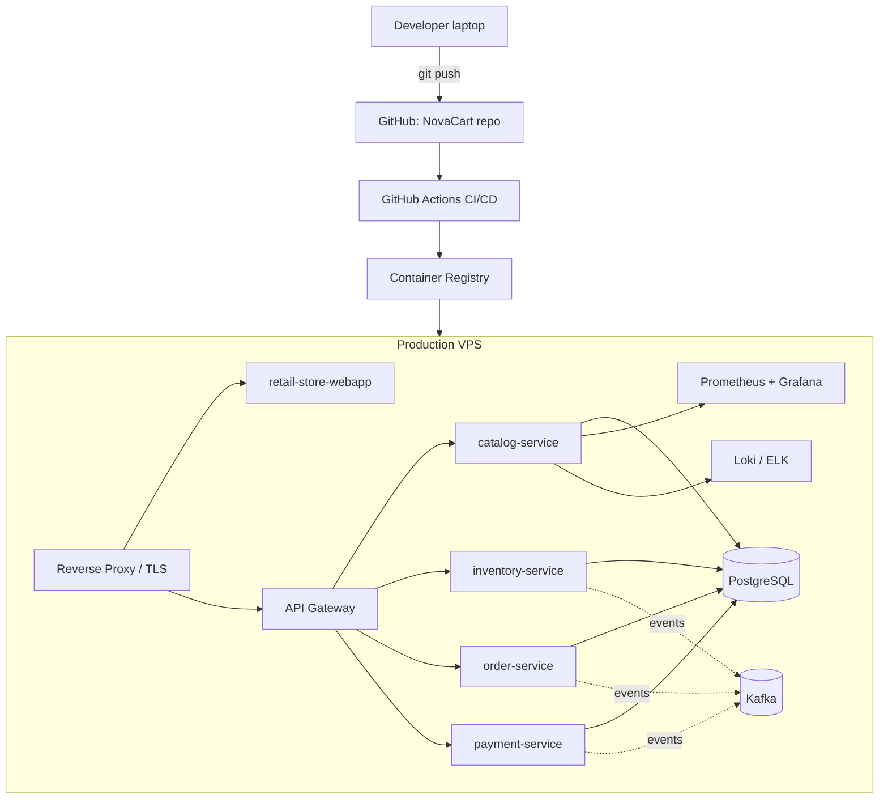

# 00 — Master Plan: NovaCart Enterprise Simulation Lab

## Project Goal

Biến 1 VPS trắng thành một môi trường mô phỏng vận hành của một công ty
thương mại điện tử thật ("NovaCart") — đi từ SSH đầu tiên đến một hệ thống
production-like có CI/CD, observability, security, reliability và Kubernetes.
Người học đóng vai **DevOps/SRE mới được tuyển** tại NovaCart, học theo
phương pháp Feynman (problem → why → architecture → concept → hands-on →
verify → failure simulation → explain → production perspective), tự làm
trước, chỉ nhận hint khi bị kẹt, được senior mentor review sau mỗi task.

## Fictional Company

**NovaCart** — công ty thương mại điện tử vừa, bán hàng online.

- Sản phẩm: nền tảng bán lẻ trực tuyến (catalog, kho, đơn hàng, thanh toán).
- Team (5 người, roster chi tiết + mapping sang Linux account trong
  [01-foundation.md](01-foundation.md#team-roster-novacart-engineering)):
  bạn (DevOps/SRE, mới tuyển), 2 Developer (`dev1`, `dev2` — dev2 kiêm
  backup on-call), 1 QA (`qa1`), 1 Product Owner (không có Linux account).
- Môi trường: `dev` → `staging` → `production`.
- Câu chuyện kiến trúc: hệ thống *bắt đầu như một service đơn (modular
  monolith-ish)* rồi **tự tiến hóa** thành microservices qua các phase, đúng
  theo "Quy tắc architecture" trong system prompt (không nhảy thẳng vào
  microservices).

## Chosen Repository (Decision)

**Primary seed repo:**
[`rajadilipkolli/spring-boot-microservices-series-v2`](https://github.com/rajadilipkolli/spring-boot-microservices-series-v2)
— MIT license, Java 21 / Spring Boot 3.x, đang được maintain tích cực (push
gần nhất: hôm nay khi đánh giá). Repo chứa toàn bộ hệ sinh thái NovaCart cần:
`catalog-service`, `inventory-service`, `order-service`, `payment-service`,
`api-gateway`, `config-server`, `service-registry`, `retail-store-webapp`,
Kafka, PostgreSQL + Liquibase, Redis, Prometheus/Grafana/OTel, Testcontainers,
Gatling, GitHub Actions CI theo từng service, SonarCloud, Keycloak/OAuth2.

**Cách dùng:** Đóng vai một service *đơn lẻ* (`catalog-service`) như một
"modular monolith seed" cho các phase đầu (Level 0–2), sau đó **tiến hóa**
dần: thêm Postgres thật (không dùng Testcontainers cho runtime), thêm CI/CD
riêng, thêm observability riêng do người học tự dựng (không chỉ tái dùng cấu
hình có sẵn của repo), rồi mới mở rộng sang các service khác (order,
inventory, payment), Kafka, Eureka, API Gateway ở các phase sau — mô phỏng
đúng hành trình "monolith → containerized → CI/CD → observability →
reliability → microservices → Kubernetes".

**Alternative đã đánh giá (không chọn làm chính):**
[`gothinkster/spring-boot-realworld-example-app`](https://github.com/gothinkster/spring-boot-realworld-example-app)
— 1.5k+ sao, MIT, monolith thuần (JWT auth, Postgres, test tốt) nhưng ít
"bề mặt học" hơn cho các phase sau (không có sẵn message queue, không có
multi-service, ít lý do tự nhiên để mở rộng microservices). Giữ làm phương
án dự phòng nếu `catalog-service` phát sinh vấn đề không phù hợp lab.

Chi tiết đánh giá đầy đủ 2 repo nằm trong [01-foundation.md](01-foundation.md).

## Architecture Overview (target end-state)



## Phase List

| # | Plan file | Level(s) covered | Status |
|---|-----------|-------------------|--------|
| 1 | [01-foundation.md](01-foundation.md) | Level 0 — VPS Foundation | **In progress** |
| 2 | 02-application-deployment.md | Level 1 — Deploy catalog-service | Not started |
| 3 | 03-ci-cd.md | Level 2 — CI/CD | Not started |
| 4 | 04-production-architecture.md | Level 3 — Add DB/Redis/queue/worker | Not started |
| 5 | 05-observability.md | Level 4 — Prometheus/Grafana/Loki | Not started |
| 6 | 06-security.md | Level 5 — Security hardening | Not started |
| 7 | 07-reliability.md | Level 6 — Backup/DR/zero-downtime | Not started |
| 8 | 08-kubernetes.md | Level 7 — Kubernetes/Helm/GitOps | Not started |
| 9 | 09-enterprise-simulation.md | Level 8 — Full enterprise simulation | Not started |

Plan files từ 02 trở đi **chưa được tạo** — sẽ tạo khi bắt đầu phase tương
ứng, đúng theo nguyên tắc "không nhồi tất cả vào một lần".

## Dependency Graph

```text
00-master-plan
      |
      +--> 01-foundation (VPS access, hardening, DNS/TLS ready)
              |
              +--> 02-application-deployment (clone + run catalog-service)
                      |
                      +--> 03-ci-cd
                      +--> 04-production-architecture (multi-service, DB, queue)
                              |
                              +--> 05-observability
                              +--> 06-security
                              +--> 07-reliability
                                      |
                                      +--> 08-kubernetes
                                              |
                                              +--> 09-enterprise-simulation
```

## Current Status

- Company & repo decision: **done** (this document + 01-foundation.md).
- Active plan: `01-foundation.md`, Level 0, Ticket `NOVA-001`.
- Waiting on: người học thực hiện task đầu tiên trên VPS (chưa nhận solution).

## Completed Outputs

- Fictional company "NovaCart" defined.
- Primary + alternative GitHub repo verified as real, existing, actively
  maintained (checked via GitHub API, not assumed from memory).
- Target architecture diagram drafted.

## Next Plan

`02-application-deployment.md` — sẽ tạo sau khi Level 0 (VPS foundation)
hoàn tất và được review.

## Known Risks

- `catalog-service` phụ thuộc Kafka để chạy đầy đủ tính năng (publish/consume
  event) — cần quyết định ở Phase 2 xem có trì hoãn Kafka đến Level 3 hay
  không (khuyến nghị: trì hoãn, chạy catalog-service chỉ với Postgres trước).
- Repo alternative (`gothinkster`) đã hơn 1 năm không có commit mới (tính đến
  thời điểm đánh giá) — chỉ dùng nếu primary repo gặp vấn đề chặn tiến độ.
- VPS cụ thể (nhà cung cấp, IP, spec) chưa được người học cung cấp — cần hỏi
  ở đầu Level 0 trước khi đưa lệnh SSH cụ thể.

## Important Decisions

- Kiến trúc tiến hóa dần: **không** dựng toàn bộ microservices của repo ngay
  từ đầu, dù repo hỗ trợ sẵn — chỉ dùng `catalog-service` cho Level 0–2.
- Toàn bộ project thực hành dùng Java/Spring Boot theo yêu cầu bắt buộc của
  system prompt (mục 15).
- Không tự bịa repository; mọi repo đề xuất đã được xác minh tồn tại qua
  GitHub API tại thời điểm viết plan này (2026-08-16).
- **Ticket template mở rộng (2026-08-17):** mọi ticket từ nay về sau — trong
  mọi plan file, không chỉ 01-foundation — phải có thêm mục
  **"Reflection Questions (Feynman)"** ở cuối: 2–4 câu hỏi "tại sao/nếu thì
  sao" buộc người học tự giải thích lại bản chất bằng lời của mình, không
  chỉ hoàn thành acceptance criteria bằng thao tác. Đây là yêu cầu trực tiếp
  từ người học, áp dụng cho toàn bộ chương trình.
- **Team roster & RBAC model (2026-08-19):** team kỹ thuật NovaCart cố định
  ở **5 người** — không thêm dev cho đến khi scope vượt quá 1 service (Level
  3+ khi có thêm `inventory-service`/`order-service`). Lý do: 2 dev là đủ để
  dạy group-based permission (group chỉ có ý nghĩa khi ≥2 người share cùng
  profile); vượt quá ~6 người thì bài học đúng phải chuyển sang centralized
  identity (Okta/LDAP/Teleport) — ngoài phạm vi chương trình hiện tại. Chi
  tiết account/group/ACL/sudoers nằm trong ticket `NOVA-002`
  (`01-foundation.md`).

## Handoff to Next Plan

Completed:
- Company narrative, repo decision, target architecture.

Artifacts Created:
- `plans/00-master-plan.md` (this file)
- `plans/01-foundation.md`

Configuration Changed:
- None yet (no VPS access established).

Decisions:
- See "Important Decisions" above.

Known Issues:
- None yet.

Prerequisites for Next Plan:
- Level 0 (VPS foundation) phải hoàn tất: SSH access ổn định, non-root sudo
  user, firewall cơ bản, trước khi sang `02-application-deployment.md`.

Next Plan:
- `02-application-deployment.md` (chưa tạo).
